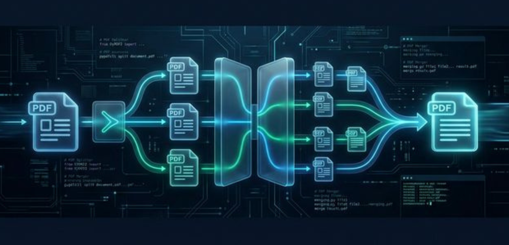
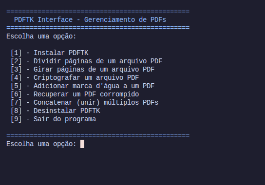

<h1 align="center">
    PDFTK Interface - Gerenciamento de PDFs
 <br />
 <br />
 <a href="https://github.com/StellaKarolinaNunes/PDFTK-Interface---Gerenciamento-de-PDFs">
  
 </a>
</h1>

<p align="center">
  
  
  
  
</p>

<br>

---

---

##  Introdução
Este projeto foi desenvolvido como parte da disciplina de Shell Script no curso de Ciência da Computação. Ele consiste em uma interface em Bash criada para facilitar o uso do PDFTK no gerenciamento de arquivos PDF, tornando operações como divisão, rotação, criptografia, concatenação e recuperação de PDFs muito mais acessíveis via terminal. O objetivo é simplificar tarefas comuns do dia a dia com PDFTK, centralizando todas as funcionalidades em um menu interativo e amigável.

<br>

## Por que PDFTK Interface?
O PDFTK é uma ferramenta poderosa para manipulação de arquivos PDF, mas sua interface de linha de comando pode ser intimidadora para usuários iniciantes. Este projeto visa democratizar o acesso ao PDFTK, oferecendo uma interface amigável e interativa que permite realizar operações complexas com apenas alguns cliques. Além disso, o projeto serve como uma ferramenta educacional, demonstrando o potencial do Shell Script para automatizar tarefas repetitivas e criar interfaces personalizadas para ferramentas de linha de comando.

<br>

## A Solução
A **PDFTK Interface** é uma ferramenta que automatiza tarefas comuns de manipulação de PDF, oferecendo uma interface amigável e interativa para o usuário. Com ela, é possível realizar operações como divisão, rotação, criptografia, concatenação e recuperação de PDFs com apenas alguns cliques, sem a necessidade de memorizar comandos complexos.

<br>

## Funcionalidades Principais

* **Instalar PDFTK facilmente**
* **Dividir páginas de um arquivo PDF**
* **Girar páginas específicas ou o PDF todo**
* **Criptografar arquivos PDF**
* **Adicionar marca d'água (background)**
* **Recuperar PDFs corrompidos**
* **Concatenar (unir) múltiplos arquivos PDF**
* **Menu interativo para fácil navegação**
* **Desinstalar PDFTK facilmente**
* **Divisão de PDFs**
* **Rotação de Páginas**
* **Criptografia Segura**
* **Marca d'água Profissional**
* **Recuperar Arquivos**
* **Concatenação de Múltiplos PDFs**
* **Gestão de Dependências**
* **Validação em Tempo Real**

<br>

 ## Layout da Aplicação 

<p align="center">
  

 <br>

---

 ##  Estrutura de Pastas

 A estrutura do projeto segue o padrão de organização por camadas, facilitando a manutenção e escalabilidade.

```bash
pdftk-interface/
├── modules/                  # Módulos do sistema
│   ├── setup.sh        # Instalação, Desinstalação e Dependências
│   └── ops.sh          # Operações de manipulação de PDF
├── fluxograma/         # Documentação de fluxo
│   └── FLUXOGRAMA.md
├── pdftk.sh            # Arquivo principal (Menu)
├── README.md           # Documentação geral
├── assets/                   # Recursos estáticos
```

<br>

>  **Fluxograma do Projeto**: Caso queira entender a lógica de navegação e processos do aplicativo, acesse o arquivo [fluxograma/FLUXOGRAMA.md](fluxograma/FLUXOGRAMA.md).


##  Instalação

### Pré-requisitos para Rodar PDFTK Interface na sua máquina 

* [Bash Shell](https://www.gnu.org/software/bash/)
* [Snap](https://snapcraft.io/) (para instalar o PDFTK)
* [PDFTK](https://snapcraft.io/pdftk) (instalado pelo próprio script)
* Permissões de sudo para instalar dependências

<br>

###  Instalação Rápida

#### 1. **Clone este repositório:**
    ```bash
    git clone https://github.com/StellaKarolinaNunes/PDFTK-Interface---Gerenciamento-de-PDFs
    cd PDFTK-Interface---Gerenciamento-de-PDFs
    ```

#### 2. **Dê permissão de execução ao script:**
    ```bash
    chmod +x pdftk.sh
    ```

#### 3. **Execute o script:**
    ```bash
    ./pdftk.sh
    ```

> **Dica:** O PDFTK será instalado automaticamente se não estiver presente.

<br>

##  Roadmap


###     Fase 1: Estabilidade e UX (Atual)
- [x] Interface modularizada.
- [x] Verificação automática de dependências.
- [x] Validação de existência de arquivos.
- [x] Barra de progresso para instalações.

### Fase 2: Produtividade e Lote
- [ ] **Processamento em Lote (Batch)**: Opção para aplicar a mesma operação em todos os PDFs de uma pasta.
- [ ] **Nomenclatura Customizada**: Permitir que o usuário digite o nome do arquivo de saída.
- [ ] **Extração de Texto**: Integração com ferramentas para converter PDF em TXT.

### Fase 3: Recursos Avançados
- [ ] **Conversão de Formatos**: Converter Imagens (JPG/PNG) para PDF e vice-versa.
- [ ] **Compressão de PDF**: Função para reduzir o tamanho dos arquivos PDF.
- [ ] **Edição de Metadados**: Visualizar e editar título, autor e metadados.

### Fase 4: Ecossistema e Acessibilidade
- [ ] **Instalação Global**: Script para adicionar o projeto ao PATH do sistema.
- [ ] **Interface Gráfica (GUI)**: Versão usando `zenity` ou `yad` para janelas.

<br>

##  Contribuição
Contribuições são muito bem-vindas! Siga estes passos:

### Como Contribuir
1. **Fork** este repositório como cotribuir completo,sem comentario e emogi profissional e atraente e copleto
2. 
3. **Clone** seu fork localmente
4. **Crie** uma branch para sua feature: `git checkout -b feature/nova-funcionalidade`
5. **Faça** suas alterações e commits
6. **Teste** suas modificações
7. **Abra** um Pull Request detalhado

<br>

###  Diretrizes

- Código limpo e bem comentado
- Mensagens de commit claras e objetivas
- Teste todas as funcionalidades
- Mantenha a documentação atualizada
- Siga os padrões de código existentes

<br>

##  Licença

Este projeto está licenciado sob a [Licença MIT](LICENSE).

``` bash
MIT License - você pode usar, modificar e distribuir livremente,
mantendo a referência ao repositório original.
```

 <br>
 
 ## Créditos

 O **PDFTK Interface** é construído com o apoio de tecnologias e comunidades incríveis:

 - **Motor Principal:** [PDFTK - PDF Labs](https://www.pdflabs.com/)
 - **Gestão de Dependências:** [Snapcraft](https://snapcraft.io/)
 - **Framework de Execução:** [Bash Shell](https://www.gnu.org/software/bash/)
 - **Diagramação:** [Mermaid.js](https://mermaid.live/)
 - **Badges e Design:** [Shields.io](https://shields.io/)
 - **Professor Orientador:** [Alex Santos de Oliveira](https://github.com/alex2024383)

 <br>

 
### Desenvolvimento Principal

<table>
  <tr>
    <td align="center">
      <a href="https://github.com/StellaKarolinaNunes">
        
        <br />
        <sub><b>Stella Karolina (Desenvolvedora)</b></sub>
        <br />
      </a>
    </td>
  </tr>
</table>


> _Projeto acadêmico IFPA | Ciência da Computação – Sistema de Backup em Shell Script para automação e aprendizado de rotinas de PDFTK Interface Gerenciamento de PDFs no Linux._
