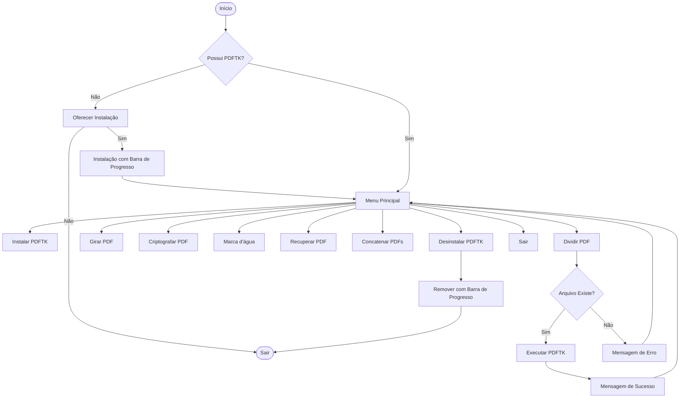

# Fluxograma do Projeto - PDFTK Interface

Este documento apresenta a lógica de funcionamento e a estrutura funcional do projeto.

## Estrutura de Arquivos
```text
PDFTK-Interface-Gerenciamento-de-PDFs/
├── pdftk.sh            # Arquivo principal (Menu)
├── modules/            # Módulos do sistema
│   ├── setup.sh        # Instalação, Desinstalação e Dependências
│   └── ops.sh          # Operações de manipulação de PDF
├── fluxograma/         # Documentação de fluxo
│   └── FLUXOGRAMA.md
└── README.md           # Documentação geral
```

## Fluxo de Execução Principal



## Funcionalidades Detalhadas

- **Verificação Automática**: O script garante que a ferramenta necessária esteja presente antes de iniciar.
- **Divisão de Páginas**: Extração de intervalos específicos de páginas de um documento.
- **Rotação de Páginas**: Giro de páginas individuais ou de todo o documento (0º, 90º, 180º, 270º).
- **Criptografia**: Proteção de documentos PDF com senha de usuário.
- **Marca d'água**: Sobreposição de um PDF de fundo em outro documento.
- **Recuperação**: Tentativa de corrigir a estrutura de arquivos PDF corrompidos.
- **Concatenação**: Unificação de múltiplos arquivos PDF em um único documento final.
- **Desinstalação Limpa**: Remoção completa da dependência do sistema de forma automatizada.
